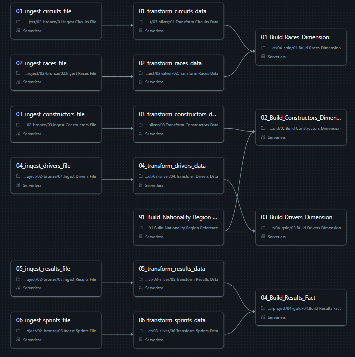

# Formula 1 Analytics — End-to-End Data Engineering Project

An end-to-end data engineering and analytics project built on **Databricks Free Edition** using the [Jolpica F1 API dataset](https://jolpi.ca/ergast/f1/). The project implements a full Medallion Architecture — from raw file ingestion to a live analytics dashboard — using Unity Catalog, Delta Lake, PySpark, Spark SQL, and Lakeflow Jobs.

---

## Table of Contents

- [Project Overview](#project-overview)
- [Architecture](#architecture)
- [Tech Stack](#tech-stack)
- [Dataset](#dataset)
- [Project Structure](#project-structure)
- [Pipeline Layers](#pipeline-layers)
  - [Landing](#landing)
  - [Bronze](#bronze)
  - [Silver](#silver)
  - [Gold](#gold)
  - [Analytics](#analytics)
- [Orchestration](#orchestration)
- [Dashboard](#dashboard)
- [Key Design Decisions](#key-design-decisions)
- [Known Issues & Improvements](#known-issues--improvements)

---

## Project Overview

This project builds a production-grade data pipeline on Databricks that ingests raw Formula 1 data across multiple file formats, transforms it through a Medallion Architecture, and surfaces it as a star-schema dimensional model powering an analytics dashboard.

**Analytical goals:**
- Driver championship standings by season
- Constructor championship standings by season
- Dominant drivers and teams of all time
- Geographical analysis by circuit and driver nationality
- Historical and recent season comparison

---

## Architecture

```
┌─────────────────────────────────────────────────────────────────┐
│                    formula1 (Unity Catalog)                      │
│                                                                  │
│  ┌──────────┐   ┌──────────┐   ┌──────────┐   ┌──────────┐     │
│  │ landing  │──▶│  bronze  │──▶│  silver  │──▶│   gold   │     │
│  │          │   │          │   │          │   │          │     │
│  │  Files   │   │  Delta   │   │  Delta   │   │  Delta   │     │
│  │  Volume  │   │  Tables  │   │  Tables  │   │  Tables  │     │
│  └──────────┘   └──────────┘   └──────────┘   └──────────┘     │
│                                                      │           │
│                                               ┌──────▼──────┐   │
│                                               │  Analytics  │   │
│                                               │    Views    │   │
│                                               └─────────────┘   │
└─────────────────────────────────────────────────────────────────┘
                                                      │
                                               ┌──────▼──────┐
                                               │  Dashboard  │
                                               └─────────────┘
```

### Medallion Layer Responsibilities

| Layer | Purpose |
|---|---|
| **Landing** | Raw file storage in Unity Catalog Files Volume. No processing. |
| **Bronze** | Ingests raw files with explicit schema, adds `ingestion_timestamp` and `source_file` metadata columns. |
| **Silver** | Selects analytics-relevant columns, standardises naming to snake_case, flattens nested structures, removes nulls and duplicates, applies title case transformations. |
| **Gold** | Dimensional model (star schema) with fact and dimension tables, nationality-to-region enrichment, and derived analytical flags. |
| **Analytics** | Spark SQL views and queries for standings, dominance analysis, and dashboard consumption. |

---

## Tech Stack

| Component | Technology |
|---|---|
| Platform | Databricks Free Edition (Serverless) |
| Catalog & Governance | Unity Catalog |
| Storage Format | Delta Lake |
| Transformation | PySpark, Spark SQL |
| Orchestration | Lakeflow Jobs (Databricks Workflows) |
| File Storage | Unity Catalog Files Volume |
| Reporting | Databricks SQL Dashboard |

---

## Dataset

Source: [Jolpica F1 API](https://jolpi.ca/ergast/f1/) — 6 files across 3 formats:

| File | Format | Description |
|---|---|---|
| `circuits.csv` | CSV | Circuit metadata — name, location, coordinates |
| `races.csv` | CSV | Race calendar — season, round, circuit, date |
| `constructors.json` | Flat JSON | Constructor/team metadata |
| `drivers.json` | Nested JSON | Driver metadata with nested `name` struct (`givenName`, `familyName`) |
| `results.json` | Nested JSON | Race results per driver per race |
| `sprints.json` | Multi-line JSON | Sprint race results |

---

## Project Structure

```
formula1-analytics/
│
├── README.md
│
├── data/
│   ├── circuits.csv
│   ├── races.csv
│   ├── constructors.json
│   ├── drivers.json
│   ├── results.json
│   └── sprints.json
│
├── notebooks/
│   ├── 00-common/
│   │   ├── 01_environment_config.py        # Centralised catalog, schema, and path variables
│   │   └── 02_bronze_helpers.py            # Reusable metadata helper functions
│   │
│   ├── 01-setup/
│   │   └── 01_setup_project_environment.sql  # Unity Catalog setup — catalog, schemas, volume
│   │
│   ├── 02-bronze/
│   │   ├── 01_ingest_circuits_file.py
│   │   ├── 02_ingest_races_file.py
│   │   ├── 03_ingest_constructors_file.py
│   │   ├── 04_ingest_drivers_file.py
│   │   ├── 05_ingest_results_file.py
│   │   └── 06_ingest_sprints_file.py
│   │
│   ├── 03-silver/
│   │   ├── 01_transform_circuits_data.py
│   │   ├── 02_transform_races_data.py
│   │   ├── 03_transform_constructors_data.py
│   │   ├── 04_transform_drivers_data.py
│   │   ├── 05_transform_results_data.py
│   │   └── 06_transform_sprints_data.py
│   │
│   ├── 04-gold/
│   │   ├── 91_build_nationality_region_reference.py
│   │   ├── 01_build_races_dimension.py
│   │   ├── 02_build_constructors_dimension.py
│   │   ├── 03_build_drivers_dimension.py
│   │   └── 04_build_results_fact.py
│   │
│   └── 05-analytics/
│       ├── 01_build_driver_standings_view.sql
│       ├── 02_build_constructors_standings_view.sql
│       ├── 03_analyse_dominant_drivers.sql
│       └── 04_analyse_dominant_constructors.sql
│
└── assets/
    ├── dashboard.png
    └── lakeflow_dag.png
```

---

## Pipeline Layers

### Landing

Raw files are uploaded to a Unity Catalog **Files Volume**:

```
/Volumes/formula1/landing/files/
├── circuits.csv
├── races.csv
├── constructors.json
├── drivers.json
├── results/          ← folder (multi-file)
└── sprints/          ← folder (multi-line JSON)
```

No transformation occurs at this layer. The volume path is centralised in `01.environment-config` and referenced across all Bronze notebooks via `%run`.

---

### Bronze

**Goal:** Ingest raw files into Delta tables with minimal transformation. Preserve original structure. Add audit metadata.

**Patterns applied:**
- Explicit schema definition on every source (`StructType` or DDL string) — no `inferSchema`
- `FAILFAST` read mode — rejects malformed records immediately
- `_metadata.file_path` captured as `source_file` column
- `current_timestamp()` captured as `ingestion_timestamp` column
- Both metadata columns added via reusable `add_ingestion_metadata()` helper from `02.bronze-helpers`
- All table and path references resolved from config variables — no hardcoded values

**Notable handling:**

`drivers.json` — nested `name` struct preserved as-is in Bronze:
```python
name_schema = StructType([
    StructField('givenName', StringType()),
    StructField('familyName', StringType()),
])
```
Flattening is deferred to Silver, keeping Bronze as a faithful representation of the source.

`sprints.json` — multi-line JSON read with:
```python
.option('multiLine', 'true')
```

**Output tables:** `formula1.bronze.circuits`, `races`, `constructors`, `drivers`, `results`, `sprints`

---

### Silver

**Goal:** Produce clean, analytics-ready Delta tables. Standardise structure, remove noise, flatten nested fields.

**Transformations applied across all notebooks:**

| Transformation | Detail |
|---|---|
| Column selection | Drop non-analytical columns (e.g. `url`) |
| Column renaming | camelCase → snake_case, descriptive names (e.g. `grid` → `grid_position`, `laps` → `completed_laps`) |
| Business key validation | Filter rows where primary keys are null |
| Deduplication | `dropDuplicates()` on composite business keys |
| Title case | `initcap()` on name and location string columns |
| Struct flattening | Nested `name` struct in drivers concatenated to single `driver_name` field |

**Drivers — struct flattening:**
```python
drivers_concatenated_df = (
    drivers_renamed_df
        .withColumn("driver_name",
                    F.initcap(F.concat_ws(" ",
                        F.col("name.givenName"),
                        F.col("name.familyName"))))
        .drop("name")
)
```
`concat_ws` handles null name parts gracefully — no trailing/leading spaces.

**Deduplication keys by table:**

| Table | Dedup Key |
|---|---|
| circuits | `circuit_id` |
| races | `season`, `round` |
| constructors | `constructor_id` |
| drivers | `driver_id` |
| results | `season`, `round`, `constructor_id`, `driver_id` |
| sprints | `season`, `round`, `constructor_id`, `driver_id` |

**Output tables:** `formula1.silver.circuits`, `races`, `constructors`, `drivers`, `results`, `sprints`

---

### Gold

**Goal:** Dimensional model (star schema) optimised for analytical queries and reporting.

#### Star Schema

```
                    ┌─────────────────┐
                    │   dim_drivers   │
                    │  driver_id (PK) │
                    │  driver_name    │
                    │  nationality    │
                    │  region         │
                    │  date_of_birth  │
                    └────────┬────────┘
                             │
┌─────────────────┐          │          ┌──────────────────────┐
│ dim_constructors│          │          │      dim_races        │
│ constructor_id  │          │          │  season + round (PK)  │
│ constructor_name│    ┌─────▼──────┐   │  race_name            │
│ nationality     │───▶│   fact_    │◀──│  race_date            │
│ region          │    │  session_  │   │  circuit_name         │
└─────────────────┘    │  results  │   │  locality             │
                        │           │   │  country              │
                        │ is_win    │   │  latitude / longitude │
                        │ is_podium │   └──────────────────────┘
                        │ has_points│
                        └───────────┘
```

#### Fact Table — `fact_session_results`

Results and sprints are unioned into a single fact table with a `session_type` discriminator:

```python
results_with_type = silver_results_df.withColumn("session_type", F.lit("RACE"))
sprints_with_type = silver_sprints_df.withColumn("session_type", F.lit("SPRINT"))
fact_df = results_with_type.unionByName(sprints_with_type)
```

Derived analytical flags:

| Column | Logic |
|---|---|
| `is_win` | `final_position == 1` |
| `is_podium` | `final_position` between 1 and 3 |
| `has_points` | `points > 0` |

#### Dimension Tables

**`dim_races`** — joins `silver.races` with `silver.circuits` to embed circuit geography directly into the race dimension, avoiding a separate circuit join at query time.

**`dim_drivers` / `dim_constructors`** — enriched with `region` via left join to the nationality-region reference table (`91.Build Nationality Region Reference`). `left` join ensures drivers/constructors with unmapped nationalities still appear with a `null` region rather than being dropped.

#### Nationality Region Reference

A static reference DataFrame mapping 50+ nationalities to 7 regions (Europe, North America, South America, Africa, Asia, Oceania) — built programmatically using `spark.createDataFrame(rows)` and stored as a Gold Delta table.

**Output tables:** `formula1.gold.dim_races`, `dim_drivers`, `dim_constructors`, `fact_session_results`

---

### Analytics

**Goal:** Standing aggregations and dominance analysis for dashboard consumption.

#### Driver & Constructor Standings Views

```sql
CREATE OR REPLACE VIEW formula1.gold.v_driver_standing AS
WITH driver_session_summary AS (
    SELECT
        r.season,
        d.driver_name,
        COUNT(*)                              AS race_starts,
        SUM(r.points)                         AS total_points,
        COUNT_IF(r.is_win)                    AS number_of_wins,
        COUNT_IF(r.is_podium)                 AS number_of_podiums
    FROM formula1.gold.fact_session_results r
    JOIN formula1.gold.dim_drivers d ON r.driver_id = d.driver_id
    GROUP BY r.season, d.driver_name
)
SELECT *,
    RANK() OVER (
        PARTITION BY season
        ORDER BY total_points DESC, number_of_wins DESC
    ) AS standing
FROM driver_session_summary
```

- `CREATE OR REPLACE VIEW` — always reflects current underlying data, no refresh needed
- Tiebreaker: `total_points DESC, number_of_wins DESC` — mirrors the real F1 standings rule
- `COUNT_IF(is_win)` — clean boolean aggregation, equivalent to `SUM(CASE WHEN is_win THEN 1 ELSE 0 END)`

#### Dominant Drivers / Constructors

```sql
WITH driver_metrics AS (
    SELECT
        driver_name,
        SUM(race_starts)                                          AS race_starts,
        SUM(number_of_wins)                                       AS total_wins,
        SUM(number_of_podiums)                                    AS total_podiums,
        SUM(CASE WHEN standing = 1 THEN 1 ELSE 0 END)            AS total_championships
    FROM formula1.gold.v_driver_standing
    GROUP BY driver_name
    HAVING total_championships >= 1
)
SELECT *,
    (total_championships * 100) + (total_wins * 10) + (total_podiums * 3) AS greatness_score
FROM driver_metrics
ORDER BY greatness_score DESC
```

**Greatness Score formula:**

| Component | Weight | Rationale |
|---|---|---|
| Championships | ×100 | Ultimate achievement — weighted heaviest |
| Wins | ×10 | Race wins demonstrate sustained excellence |
| Podiums | ×3 | Rewards consistency without over-inflating near-misses |

`HAVING total_championships >= 1` — this analysis is scoped to **championship winners only**, ranking their relative dominance. Drivers with wins but no title (e.g. Stirling Moss) are excluded by design.

---

## Orchestration

All notebooks are orchestrated via a **Lakeflow Jobs DAG** with explicit task-level dependencies:

```
Bronze Circuits  ──▶  Silver Circuits  ─────────────────────────▶  Gold Races Dimension
Bronze Races     ──▶  Silver Races     ──────────────────────────▶  Gold Races Dimension

Bronze Constructors ──▶  Silver Constructors ──▶  Gold Constructors Dimension
Bronze Drivers      ──▶  Silver Drivers      ──▶  Nationality Region Reference ──▶  Gold Drivers Dimension
                                                                                 └──▶  Gold Constructors Dimension

Bronze Results  ──▶  Silver Results ──▶
                                       ▶  Gold Results Fact
Bronze Sprints  ──▶  Silver Sprints ──▶
```

- Each Silver task runs only after its Bronze dependency succeeds
- Gold dimension tasks depend on their respective Silver tasks plus the nationality reference table
- `Gold Results Fact` depends on both Silver Results and Silver Sprints
- Pipeline is scheduled via trigger and is idempotent — failed tasks can be re-run without re-executing succeeded tasks



---

## Dashboard

A **Databricks SQL Dashboard** with 4 reports:

| Report | Visualisations | Filter |
|---|---|---|
| Driver Championship Standings | Standings table, wins pie chart (top 10), total points bar chart | Season |
| Constructor Championship Standings | Standings table, wins pie chart (top 10), total points bar chart | Season |
| Dominant Drivers of All Time | Dominance table (wins, podiums, championships), championships pie chart (top 10), greatness score bar chart | None (all time) |
| Dominant Constructors of All Time | Same layout as dominant drivers | None (all time) |


---

## Key Design Decisions

**Explicit schemas over `inferSchema`** — all Bronze readers define schemas explicitly and use `FAILFAST` mode. This catches data quality issues at ingestion rather than silently producing nulls downstream.

**`_metadata.file_path` for source tracking** — using Databricks' built-in file metadata column rather than hardcoding source paths makes the pipeline source-agnostic and audit-friendly.

**Centralised config via `%run`** — all catalog names, schema names, and volume paths live in a single config notebook. No hardcoded values in pipeline notebooks.

**Deduplication on business keys** — `dropDuplicates()` uses composite natural keys (e.g. `season + round + driver_id`) rather than all columns, correctly handling cases where non-key attributes may differ between duplicate rows.

**Struct flattening deferred to Silver** — the nested `name` struct in `drivers.json` is preserved in Bronze as a faithful copy of the source. Silver is the correct layer for structural normalisation.

**`unionByName` for results + sprints** — unioning both session types into a single fact table with a `session_type` discriminator is more analytics-friendly than separate fact tables. Queries for total points, win counts, or standings automatically include sprint results without additional joins.

**`left` join for nationality enrichment** — ensures no driver or constructor is silently dropped due to an unmapped nationality. Unmapped values appear as `null` region, which is visible and correctable.

**`CREATE OR REPLACE VIEW` for standings** — views stay automatically in sync with the underlying Delta tables. Re-running the ingestion pipeline immediately refreshes all downstream standings without re-running analytics notebooks.

---

## Known Issues & Improvements

| Item | Detail |
|---|---|
| `sprints` dedup bug | `sprints_final_df` in Silver is built from `sprints_valid_df` instead of `sprints_distinct_df` — duplicates not removed before write |
| `positionText` rename no-op | `positionText` renamed in Silver results but not included in the preceding `.select()` — rename has no effect |
| Redundant select blocks | `circuits` and `races` Silver notebooks contain an initial `.select()` without `F.col()` wrappers followed by a duplicate block — dead code to be cleaned |
| `Belgium` in nationality map | Both `"Belgium"` (country name) and `"Belgian"` (adjective) mapped in reference table — verify which form appears in source data and remove the unused entry |
| Boolean flag compatibility | `is_win`, `is_podium`, `has_points` are `BooleanType` — consider casting to `IntegerType` (0/1) for broader BI tool compatibility |
| Surrogate keys | Dimension tables use natural keys — surrogate keys (`monotonically_increasing_id()`) would improve join performance at scale |
| `race_starts` includes sprints | `COUNT(*) AS race_starts` in standings views counts both RACE and SPRINT sessions — rename to `total_sessions` or filter by `session_type = 'RACE'` for accuracy |
